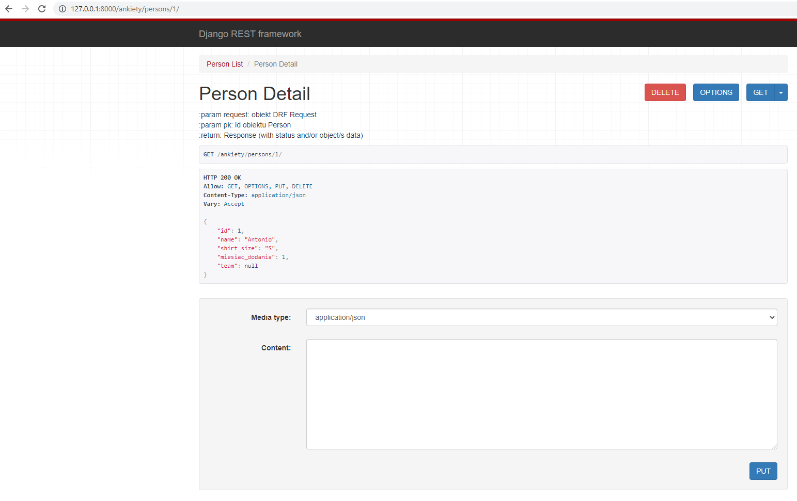

# Projektowanie aplikacji webowych, semestr 2024Z

## Lab 8

### **1. Wykorzystanie widoków APIView do tworzenia endpointów REST API.**

> **Ważne: Aby skorzystać z widoków dla REST API dostarczanych z frameworkiem DRF należy w pliku `projekt\settings.py` dodać w `INSTALLED_APPS` wpis `rest_framework`.**

W odróżnienu od klasy `HttpRequest` z frameworka Django, DRF wykorzystuje rozszerzającą ją klasę `Request`, która jest lepiej przystosowana do obsługi żądań REST. Wszelkie wartości takiego żądania znajdują się w zmiennej `request.data` w odróżnieniu od `request.POST` (klasa `HttpRequest`).
Do obsługi odpowiedzi wykorzystywana jest natomiast klasa `Response`, która w podstawowej formie zawiera wszelkie dane w surowej formie i dopiero w fazie negocjacji z klientem decyduje o ich postaci.

Chcąc stworzyć endpoint REST możemy wykorzystać dwa opakowania (ang. wrappers) z DRF:
* dekorator `@api_view` dla widoków opartych na funkcjach,
* klasę `APIView` dla widoków opartych na klasach.

> UWAGA! Z racji tego, że mamy już widoki dla URL-i zdefiniowanych poniżej i jeżeli chcielibyśmy zachować widoki z szablonami, lepiej jest stworzyć
> oddzielny plik dla widoków z api REST. Tworzymy więc nowy plik `myapp\api_urls.py` oraz nowy plik z widokami `myapp\api_views.py`.

Poniżej przykład implementacji endpointu opartego na widokach funkcyjnych (plik `myapp\api_views.py` wewnątrz struktury danej aplikacji.)

**_Listing 5_**
```python
from django.shortcuts import render
from rest_framework import status
from rest_framework.decorators import api_view
from rest_framework.response import Response
from .models import Person, Team
from .serializers import PersonSerializer

# określamy dostępne metody żądania dla tego endpointu
@api_view(['GET'])
def person_list(request):
    """
    Lista wszystkich obiektów modelu Person.
    """
    if request.method == 'GET':
        persons = Person.objects.all()
        serializer = PersonSerializer(persons, many=True)
        return Response(serializer.data)


@api_view(['GET', 'PUT', 'DELETE'])
def person_detail(request, pk):

    """
    :param request: obiekt DRF Request
    :param pk: id obiektu Person
    :return: Response (with status and/or object/s data)
    """
    try:
        person = Person.objects.get(pk=pk)
    except Person.DoesNotExist:
        return Response(status=status.HTTP_404_NOT_FOUND)

    """
    Zwraca pojedynczy obiekt typu Person.
    """
    if request.method == 'GET':
        person = Person.objects.get(pk=pk)
        serializer = PersonSerializer(person)
        return Response(serializer.data)

    elif request.method == 'PUT':
        serializer = PersonSerializer(person, data=request.data)
        if serializer.is_valid():
            serializer.save()
            return Response(serializer.data)
        return Response(serializer.errors, status=status.HTTP_400_BAD_REQUEST)

    elif request.method == 'DELETE':
        person.delete()
        return Response(status=status.HTTP_204_NO_CONTENT)

```

Teraz należy jeszcze w klasie serializera dodać implementację metody `update`, która jest wywoływana dla metody `PUT` dla endpointu `person_detail`.
Dobre praktyki jednak mówią o tym, że powinniśmy dla każdej operacji przygotować oddzielny endpoint, co pozwoli też na lepszą granulację uprawnień w tak stworzonym systemie. Aby dodać metodę stworzenia nowego obiektu dla danego modelu możemy to zrobić dla metody `PUT` (chociaż dobre praktyki też mówią o tym, że powinien być używany do operacji UPDATE) lub lepiej przez metodę `POST`.

**_Listing 6_**
```python
    def update(self, instance, validated_data):
        instance.firstname = validated_data.get('firstname', instance.firstname)
        instance.lastname = validated_data.get('lastname', instance.lastname)
        instance.shirt_size = validated_data.get('shirt_size', instance.shirt_size)
        instance.month_added = validated_data.get('month_added', instance.month_added)
        instance.team = validated_data.get('team', instance.team)
        instance.save()
        return instance
```

Aby całość zadziałała jak należy, niezbędne jest dodanie również odpowienich wpisów w plikach `urls.py` odpowiednich aplikacji projektu.


**_Listing 7_**
```python
# plik myapp\api_urls.py

from django.urls import path, include
from . import api_views

urlpatterns = [
    path('persons/', views.person_list),
    # tu oczekujemy przekazania parametru typu int
    # który będzie w tym widoku dostępny poprzez zmienną o nazwie pk
    path('persons/<int:pk>/', views.person_detail),
]
```

Więcej o sposobie budowania URL-i w aplikacji Django znajdziesz w dokumentacji: https://docs.djangoproject.com/en/4.2/topics/http/urls/

I przykładowy plik `myproject\urls.py` z importem url'i danej aplikacji zaktualizowany o nowe pliki `api_urls`.

**_Listing 8_**
```python
from django.contrib import admin
from django.urls import path, include


urlpatterns = [
    path('admin/', admin.site.urls),
    path('myapp/', include('myapp.urls')),
    path('api/', include('myapp.api_urls'))
]
```

Umieszczając definicje dla każdej aplikacji wewnątrz jej struktury, uniezależniamy ją jeszcze bardziej od głównego projektu i możemy łatwiej przenosić pomiędzy projektami. Wymagane jest jeszcze dołączenie tych urli w pliku `urls.py` głównego projektu.

Po poprawnej konfiguracji widok standardowy w oknie przeglądarki może wyglądać tak:



### **2. Walidacja danych w procesie serializacji.**

#### **2.1 Walidacja na poziomie pojedynczego pola.**

Oprócz automatycznej walidacji wartości pól na podstawie wybranego typu pola (numeryczne, tekstowe, daty itd.) możliwe jest również zdefiniowanie reguł walidacji, które są nieco bardziej złożone lub specyficzne dla danego problemu biznesowego. Aby automatycznie przypisać taki walidator dla konkretnego pola musimy jego nazwę zdefiniowac wg. wzorca `.validate_<nazwa_pola>` wewnątrz serializera. Metoda ta przyjmuje pojedynczy argument, który jest wartością pola, które ma zostać poddane walidacji. Ta metoda zwraca zwalidowaną wartość pola lub zgłasza wyjątek `serializers.ValidationError`. Przykład poniżej.

**_Listing 1_**
```python
# fragment klasy PersonSerializer

# walidacja wartości pola firstname
    def validate_firstname(self, value):

        if not value.istitle():
            raise serializers.ValidationError(
                "Imię powinno rozpoczynać się wielką literą!",
            )
        return value
```

Jeżeli walidacja danego pola nie powiedzie się to zmienna `.errors` przechowa stosowny komunikat o błędzie i nie pozwoli na zapisanie obiektu przed usunięciem wszystkich błędów.

#### **2.2 Walidacja na poziomie obiektu.**

Walidacja na poziomie obiektu jest potrzebna, kiedy niezbędne jest wykorzystanie dostępu do wielu pól. Przykład (z oficjalnej dokumentacji) poniżej.

**_Listing 2_**
```python
class EventSerializer(serializers.Serializer):
    description = serializers.CharField(max_length=100)
    start = serializers.DateTimeField()
    finish = serializers.DateTimeField()

    def validate(self, data):
        """
        Check that start is before finish.
        """
        if data['start'] > data['finish']:
            raise serializers.ValidationError("finish must occur after start")
        return data
```

#### **2.3 Własne i wbudowane walidatory.**

W przypadku gdy nasze reguły walidacji (oprócz już tych wbudowanych we frameworku) trzeba wykorzystać w wielu polach i wielu serializerach, najlepszym pomysłem jest zdefiniować je jako zewnętrzne funkcje lub obiekty. Można to zrobić wewnątrz pliku z kodem serializerów, ale jeszcze lepszym pomysłem będzie wyniesienie ich do oddzielnego modułu (pliku). Poniżej przykład dla pierwszego przypadku (również z oficjalnej dokumentacji DRF).

**_Listing 3_**
```python
# metoda walidująca, można stworzyć oddzielny moduł z wieloma takimi metodami 
# i zaimportować w różnych miejscach projektu
def multiple_of_ten(value):
    if value % 10 != 0:
        raise serializers.ValidationError('Not a multiple of ten')

class GameRecord(serializers.Serializer):
    score = IntegerField(validators=[multiple_of_ten])
    ...
```

DRF posiada również wbudowane walidatory, które mogą służyć do walidacji np. unikalności wartości w danym zbiorze (np. w tabeli w bazie danych). Przykład jego wykorzystania poniżej.

**_Listing 4_**
```python
class EventSerializer(serializers.Serializer):
    name = serializers.CharField()
    room_number = serializers.IntegerField(choices=[101, 102, 103, 201])
    date = serializers.DateField()

    class Meta:
        # Each room only has one event per day.
        validators = [
            UniqueTogetherValidator(
                queryset=Event.objects.all(),
                fields=['room_number', 'date']
            )
        ]
```

Lista oraz przykłady wykorzystania tych walidatorów znajdują się w dokumentacji pod adresem: https://www.django-rest-framework.org/api-guide/validators/
